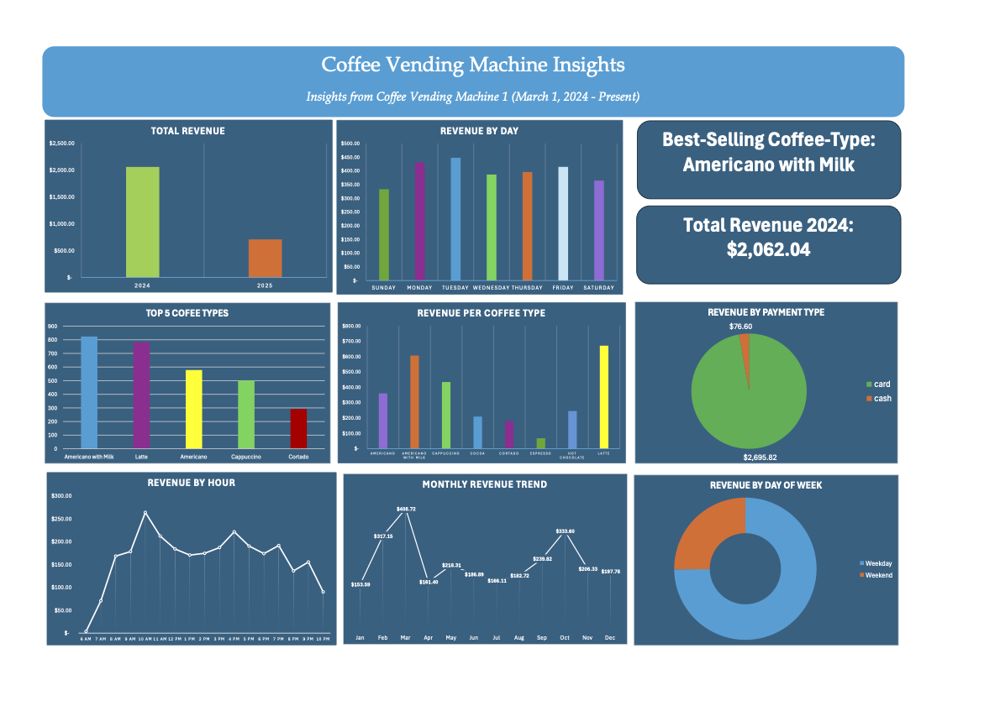

# Coffee Vending Machine Sales Dashboard
## Executive Summary
The coffee vending machine operator needed to understand what drives revenue across products, payment methods, and time periods. Without this visibility, it was difficult to optimize stocking and operations for maximum profitability.

I built an interarive Excel dashboard (powered by PivotTables and Power Query) to analyze transactions from 2024. The dashboard highlights sales trends by month, day, and hour, compares payment preferences, and identifies top-selling coffee products. 
### Key Next Steps
- Stock high demand coffee types more heavily, especially during peak hours.
- Research and perform testing on new coffee types to replace underperforming ones to increase vending machine use and total revenue. 

### Tools Used
* Microsoft Excel -> Data visualization, PivotTables, dashboard design
* Power Query -> Data cleaning, transformations, ETL workflow

## Business Question 
Which coffee products, payment methods, and times of day drive the highest revenue for the vending machine, and how can sales performance be optimized in 2025?
## Insights
* *Americano with Milk* is the most popular coffee type, contributing to 28% of units sold and 22% of total revenue.
  * **Recommendation**: The vendor should make sure the vending machine is fully stocked with Americano with Milk during peak hours which is from 8:00AM to 12:00PM.
* Espresso contributed only 4% of units sold and 2% of total revenue, making it the lowest performaning product. Cocoa (7%) and Hot Chocolate (8%) also underperformed compared to other coffee types.
  * **Recommednation**: Reduce or remove Espresso from vending machines and consider replacing Espresso with a new coffee type to test new customer demand. Also, limit the stock of Cocoa and Hot Chocolate. 
 
## Dataset Source
https://www.kaggle.com/datasets/ihelon/coffee-sales 

## Dashboard Preview

